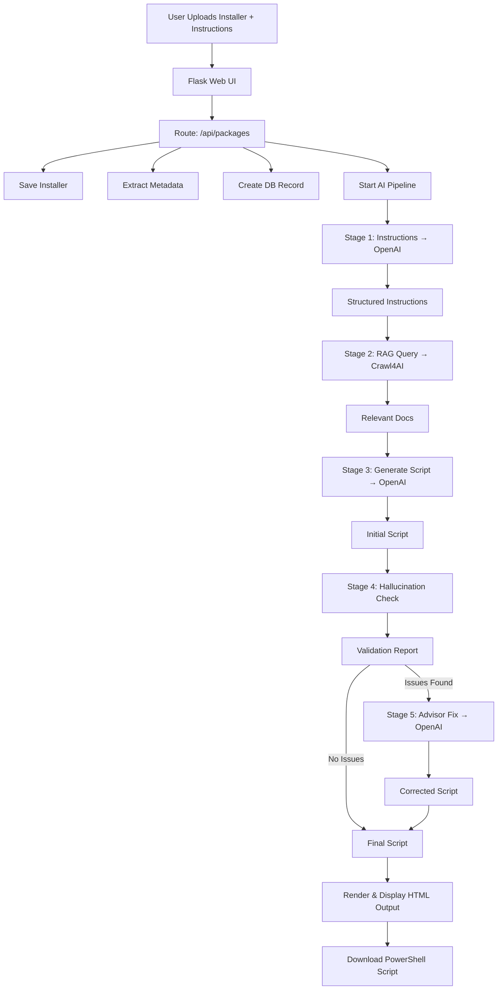

# AIPackager Architecture

```mermaid
graph TD
    A[User Uploads Installer + Instructions] --> B[Flask Web UI]
    B --> C[Route: /api/packages]
    C --> D[Save Installer]
    C --> E[Extract Metadata]
    C --> F[Create DB Record]
    C --> G[Start AI Pipeline]

    G --> H1[Stage 1: Instructions → OpenAI]
    H1 --> H2[Structured Instructions]

    H2 --> I1[Stage 2: RAG Query → Crawl4AI]
    I1 --> I2[Relevant Docs]

    I2 --> J1[Stage 3: Generate Script → OpenAI]
    J1 --> J2[Initial Script]

    J2 --> K1[Stage 4: Hallucination Check]
    K1 --> K2[Validation Report]

    K2 -->|No Issues| L[Final Script]
    K2 -->|Issues Found| M1[Stage 5: Advisor Fix → OpenAI]
    M1 --> M2[Corrected Script]
    M2 --> L

    L --> N[Render & Display HTML Output]
    N --> O[Download PowerShell Script]

    click H1 "https://platform.openai.com/" _blank
    click I1 "http://localhost:8052/sse" _blank
```