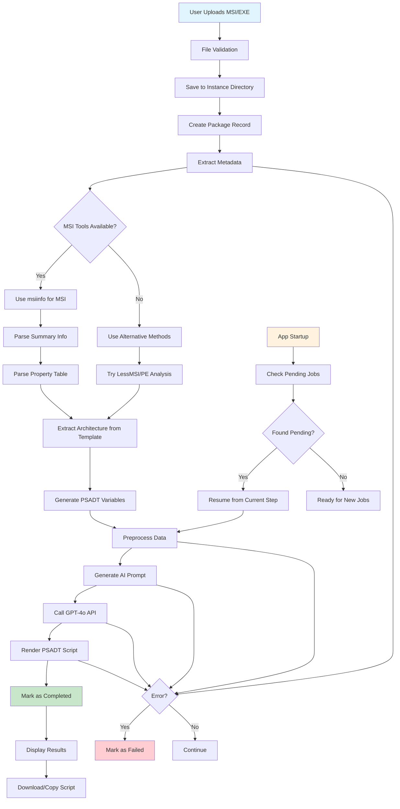
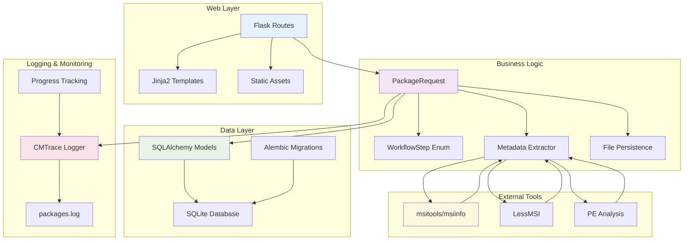
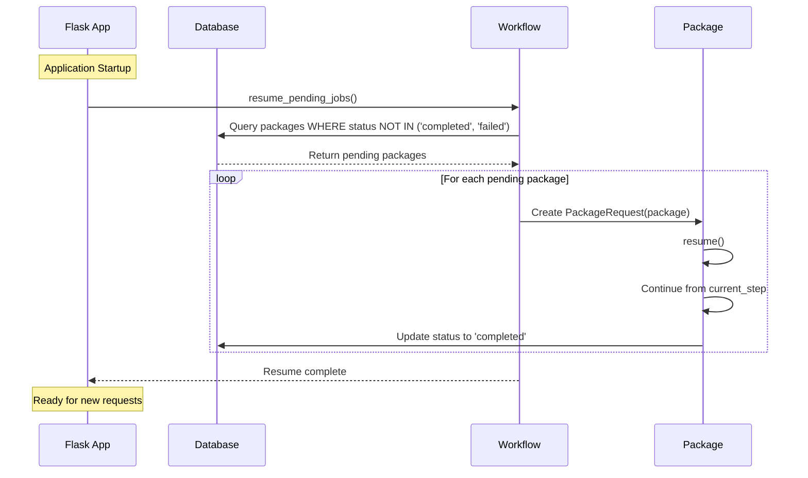

# Workflow Diagram

This document describes the AIPackager v3 workflow process and architecture.

## 🔄 Processing Workflow



## 📊 Workflow Steps Enum

```python
class WorkflowStep(enum.Enum):
    UPLOAD = "upload"                    # File uploaded and validated
    EXTRACT_METADATA = "extract_metadata"  # Parsing MSI/EXE metadata
    PREPROCESS = "preprocess"            # Preparing data for AI
    GENERATE_PROMPT = "generate_prompt"  # Creating structured prompt
    CALL_AI = "call_ai"                 # Calling GPT-4o API
    RENDER_SCRIPT = "render_script"     # Finalizing PSADT script
    COMPLETED = "completed"             # Successfully finished
    FAILED = "failed"                   # Error occurred
```

## 🏗️ System Architecture



## 🔄 Resume Functionality



## 📁 File Processing Flow

```mermaid
graph LR
    A[Upload Form] --> B[File Validation]
    B --> C{Valid MSI/EXE?}
    C -->|No| D[Show Error]
    C -->|Yes| E[Generate UUID]
    E --> F[Save to instance/uploads/]
    F --> G[Create Package Record]
    G --> H[Start Workflow]

    H --> I[Extract Metadata]
    I --> J{MSI File?}
    J -->|Yes| K[Use msitools]
    J -->|No| L[PE Header Analysis]

    K --> M[Summary Info]
    M --> N[Property Table]
    N --> O[Template Parsing]
    O --> P[PSADT Variables]

    L --> Q[Version Info]
    Q --> R[Architecture Detection]
    R --> P

    P --> S[Store in Database]
    S --> T[Continue Workflow]

    style C fill:#fff3e0
    style J fill:#fff3e0
    style P fill:#e8f5e8
```



## 🎯 PSADT Variable Mapping

| Source | PSADT Variable | Fallback Strategy |
|--------|----------------|-------------------|
| Property.ProductName | `appName` | summary_subject → summary_title |
| Property.ProductVersion | `appVersion` | PE version info |
| Property.Manufacturer | `appVendor` | summary_author |
| Property.ProductCode | `productCode` | N/A (MSI only) |
| Template field | `architecture` | PE machine type |
| Property.ProductLanguage | `language` | Template language codes |

## 🔍 Metadata Extraction Strategy

### MSI Files (Preferred: msitools)
1. **Summary Information** (`msiinfo suminfo`)
   - Title, Subject, Author
   - Template (architecture + language)

2. **Property Table** (`msiinfo export Property`)
   - ProductName, ProductVersion
   - Manufacturer, ProductCode
   - UpgradeCode, ProductLanguage

3. **Fallback Methods**
   - LessMSI (if available)
   - Direct MSI database queries

### EXE Files
1. **PE Header Analysis**
   - Machine type (architecture)
   - Timestamp, characteristics

2. **Version Information Resources**
   - ProductName, ProductVersion
   - CompanyName, FileDescription

3. **Platform-Specific**
   - Windows: win32api (if available)
   - Cross-platform: Basic PE parsing

## 📈 Progress Tracking

Progress is tracked at multiple levels:

1. **Package Level**: Overall completion percentage (0-100%)
2. **Step Level**: Current workflow step enum
3. **Logging**: CMTrace format for monitoring
4. **Database**: Persistent state for resume functionality

Each step transition is logged with:
- Timestamp
- Package ID
- Step transition (old → new)
- Success/failure status
