# Enhanced Workflow Diagram - 5-Stage Self-Correcting Pipeline

## 🔄 5-Stage Processing Workflow

```mermaid
graph TD
    A[User Uploads MSI/EXE] --> B[File Validation]
    B --> C[Save to Instance Directory]
    C --> D[Create Package Record]
    D --> E[Extract Metadata]

    %% Traditional metadata extraction (unchanged)
    E --> F{MSI Tools Available?}
    F -->|Yes| G[Use msiinfo for MSI]
    F -->|No| H[Use Alternative Methods]
    G --> I[Parse Summary Info]
    I --> J[Parse Property Table]
    J --> K[Extract Architecture from Template]
    H --> L[Try LessMSI/PE Analysis]
    L --> K

    %% NEW: 5-Stage AI Pipeline
    K --> M[Start 5-Stage Pipeline]

    %% Stage 1: Instruction Processing
    M --> N1[Stage 1: Instruction Processor]
    N1 --> N2[Convert User Text to Structured Instructions]
    N2 --> N3[Predict Required PSADT Cmdlets]
    N3 --> O1{Stage 1 Success?}
    O1 -->|No| Z[Mark as Failed]
    O1 -->|Yes| P1[Store Predicted Cmdlets]

    %% Stage 2: Targeted RAG
    P1 --> Q1[Stage 2: Targeted RAG]
    Q1 --> Q2[Query Documentation for Predicted Cmdlets]
    Q2 --> Q3[Compile Focused Documentation Context]
    Q3 --> R1{Stage 2 Success?}
    R1 -->|No| Z
    R1 -->|Yes| S1[Store Documentation Context]

    %% Stage 3: Script Generation
    S1 --> T1[Stage 3: Script Generator]
    T1 --> T2[Generate Initial PowerShell Script]
    T2 --> T3[Apply PSADT Template Structure]
    T3 --> U1{Stage 3 Success?}
    U1 -->|No| Z
    U1 -->|Yes| V1[Store Initial Script]

    %% Stage 4: Hallucination Detection
    V1 --> W1[Stage 4: Hallucination Detector]
    W1 --> W2[Validate Script Against Knowledge Graph]
    W2 --> W3[Identify Invalid Cmdlets/Parameters]
    W3 --> X1{Hallucinations Found?}
    X1 -->|No| Y1[Mark as Completed]
    X1 -->|Yes| X2[Generate Hallucination Report]

    %% Stage 5: Advisor Correction
    X2 --> Y2[Stage 5: Advisor AI]
    Y2 --> Y3[Query RAG for Correction Documentation]
    Y3 --> Y4[Generate Corrected Script]
    Y4 --> Y5[Validate Corrections]
    Y5 --> Y6{Correction Success?}
    Y6 -->|No| Z
    Y6 -->|Yes| Y1

    %% Final Steps
    Y1 --> AA[Display Results with Pipeline Report]
    AA --> BB[Download/Copy Script + Metrics]

    %% Resume Logic (Enhanced)
    CC[App Startup] --> DD[Check Pending Jobs]
    DD --> EE{Found Pending?}
    EE -->|Yes| FF[Resume from Current Pipeline Stage]
    EE -->|No| GG[Ready for New Jobs]
    FF --> M

    %% Styling
    style N1 fill:#e3f2fd
    style Q1 fill:#f3e5f5
    style T1 fill:#e8f5e8
    style W1 fill:#fff3e0
    style Y2 fill:#fce4ec
    style Y1 fill:#c8e6c9
    style Z fill:#ffcdd2
```



## 📊 Enhanced Workflow Steps

```python
class WorkflowStep(enum.Enum):
    UPLOAD = "upload"
    EXTRACT_METADATA = "extract_metadata"
    STAGE_1_INSTRUCTION_PROCESSING = "stage_1_instruction_processing"
    STAGE_2_TARGETED_RAG = "stage_2_targeted_rag"
    STAGE_3_SCRIPT_GENERATION = "stage_3_script_generation"
    STAGE_4_HALLUCINATION_DETECTION = "stage_4_hallucination_detection"
    STAGE_5_ADVISOR_CORRECTION = "stage_5_advisor_correction"
    COMPLETED = "completed"
    FAILED = "failed"
```

## 🏗️ Enhanced System Architecture

```mermaid
graph TB
    subgraph "Web Layer"
        A[Flask Routes] --> B[Enhanced Templates]
        A --> C[Pipeline Progress UI]
    end

    subgraph "5-Stage AI Pipeline"
        D[Pipeline Orchestrator] --> E[Stage 1: Instruction Processor]
        D --> F[Stage 2: Targeted RAG]
        D --> G[Stage 3: Script Generator]
        D --> H[Stage 4: Hallucination Detector]
        D --> I[Stage 5: Advisor AI]
    end

    subgraph "Knowledge & Validation"
        J[crawl4ai-rag MCP] --> K[PSADT Documentation]
        J --> L[Knowledge Graph]
        J --> M[Hallucination Detection]
    end

    subgraph "Data Layer"
        N[Enhanced Models] --> O[Pipeline State Tracking]
        P[Alembic Migrations] --> O
    end

    A --> D
    D --> J
    F --> J
    H --> J
    I --> J
    D --> N

    style D fill:#e3f2fd
    style J fill:#f3e5f5
    style N fill:#e8f5e8
